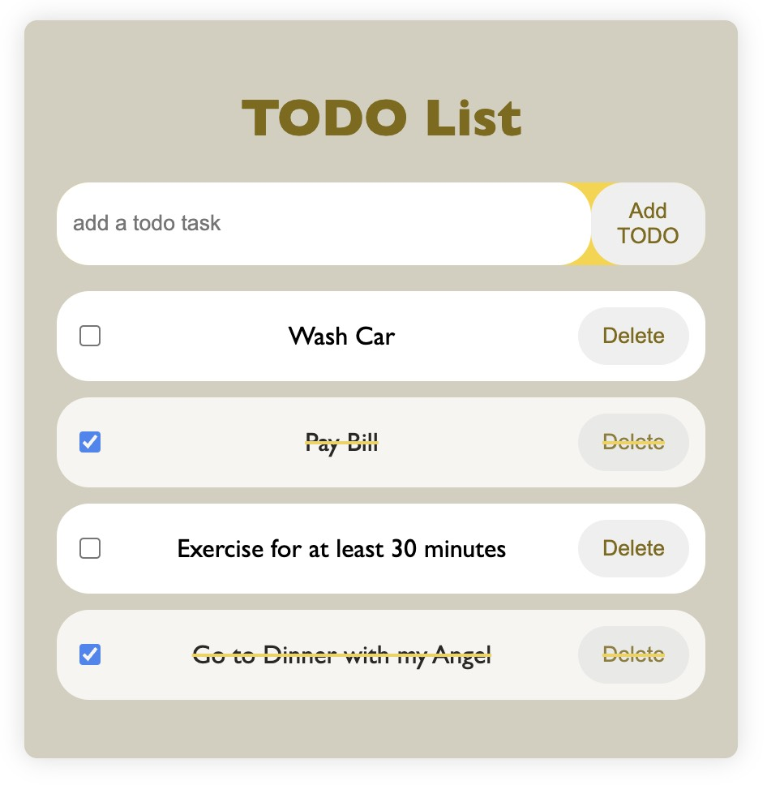

# Todo List App

This is a simple todo list app built with JavaScript and HTML. It allows you to add, delete, and mark todos as complete.

## Features

To use the app, simply type in a todo item and press the "Add" button. You can then mark the todo as complete by clicking the checkbox next to it. To delete a todo, click the "Delete" button.

Screenshot

How to contribute

If you would like to contribute to this project, please fork the repository and make your changes. Once you are finished, submit a pull request.

License

This project is licensed under the MIT License.
